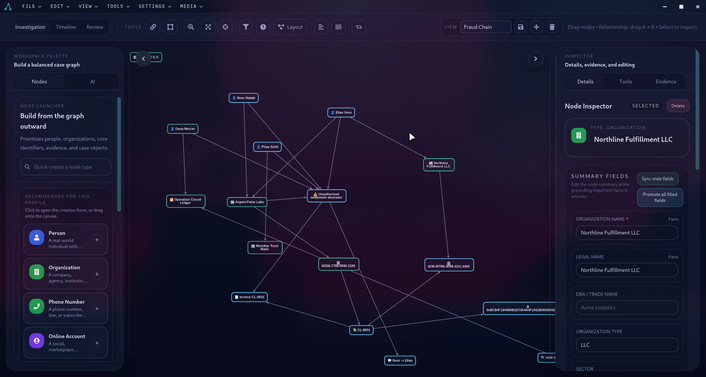
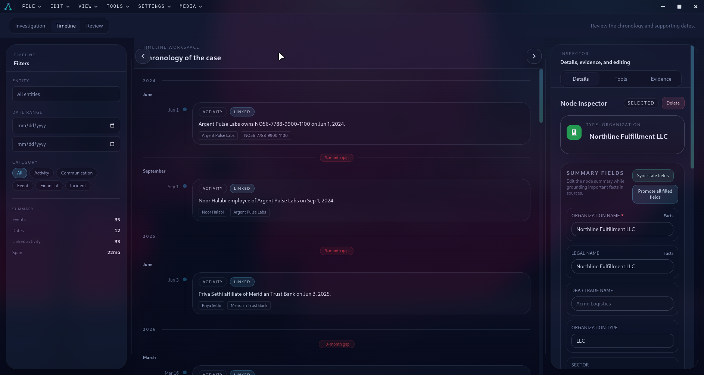
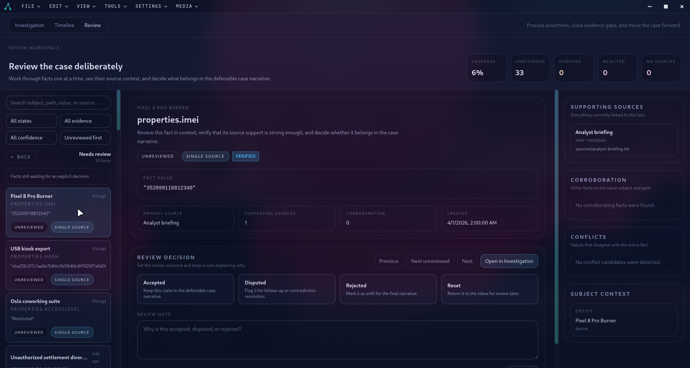

# Vitni

Vitni is a local-first desktop workspace for structured investigations.

It helps investigators map entities, relationships, evidence, sources, assertions, chronology, and review decisions in one case file. The goal is not just to draw a graph; it is to keep case knowledge source-backed, reviewable, and exportable.



## What Vitni Is For

Vitni is built for private investigators, researchers, OSINT practitioners, and small teams who need a local case workspace instead of a cloud-first SaaS workflow.

Use it to:

- Build a graph of people, organizations, accounts, devices, locations, domains, transactions, events, and evidence.
- Store factual claims as source-backed assertions instead of loose notes.
- Review assertions deliberately, including conflicts, weak support, disputed claims, and accepted facts.
- Turn dated entities into a chronology for narrative case analysis.
- Attach media and source files while preserving structured case context.
- Export case reports from the structured investigation data.

Vitni keeps enrichment and AI explicit. Remote transforms run only when invoked, local AI is optional, and cloud AI is limited to report-generation workflows you choose to run.

## Core Workspaces

Vitni is organized around three top-level workspaces.

### Investigation

The Investigation workspace is the main graph canvas. Create nodes, connect relationships, inspect sources and assertions, run compatible transforms, filter the graph, and arrange complex cases with layout presets.

The shipped sample case demonstrates a realistic mix of people, organizations, accounts, domains, devices, transactions, evidence, assertions, and saved views.

Manual: [Investigation Workspace](./docs/manual/03-investigation-workspace.md)

### Timeline



The Timeline workspace turns dated entities into a chronological view. It is designed for checking sequence, spotting unexplained gaps, and turning graph structure into an investigation narrative.

Manual: [Timeline Workspace](./docs/manual/07-timeline.md)

### Review



The Review workspace is where assertions become defensible case knowledge. Work through unreviewed, disputed, weakly supported, and unsupported claims; compare sources; accept, dispute, or reject assertions; and leave review notes.

Manual: [Review Workspace](./docs/manual/08-review.md)

## Key Capabilities

- **Source-backed assertions**: Every field value can be represented as a claim tied to a source, confidence level, and review state.
- **Conflicting evidence support**: Multiple assertions can exist for the same property, so Vitni can preserve disagreement instead of overwriting it.
- **Rich node model**: People, organizations, technical entities, locations, events, transactions, evidence, documents, and media have purpose-built fields and inspector treatment.
- **Transforms**: Run local PDF extraction or remote WHOIS, DNS, and IP lookups from compatible nodes with explicit consent.
- **CSV import**: Bring structured records into an existing case.
- **Saved views**: Preserve useful graph perspectives for later analysis.
- **Report exports**: Generate full, selection, timeline, or person-profile reports, with optional attachment bundling and optional AI narrative.
- **Personalization**: Choose investigation profiles, visual themes, canvas backgrounds, icon packs, and other workspace preferences.

## User Manual

The full manual lives in [`docs/manual`](./docs/manual/README.md). Start there for product workflows and feature-specific guidance.

Useful sections:

- [Getting Started](./docs/manual/02-getting-started.md)
- [Core Concepts](./docs/manual/01-core-concepts.md)
- [Assertions and Sources](./docs/manual/06-assertions-and-sources.md)
- [Transforms](./docs/manual/09-transforms.md)
- [Saved Views](./docs/manual/10-saved-views.md)
- [Local AI Insights](./docs/manual/11-local-ai.md)
- [Export Reports](./docs/manual/12-export-reports.md)
- [Settings and Personalization](./docs/manual/13-settings.md)
- [Command Palette and Shortcuts](./docs/manual/14-shortcuts.md)
- [Typical Workflows](./docs/manual/15-workflows.md)

Planning:

- [Vitni 1.0.0 Checklist](./docs/1.0-checklist.md)

## Try the Sample Case

The fastest way to understand Vitni is to open the included sample investigation:

[`samples/operation-glass-harbor.vitni`](./samples/operation-glass-harbor.vitni)

Open it from the app with:

```text
File -> Open Project
```

If the sample SQLite database has not been generated yet, initialize it once:

```bash
cd samples/operation-glass-harbor.vitni
sqlite3 db/case.sqlite < db/case.sqlite.sql
```

Then return to the repository root, start Vitni, and open the sample project folder.

## Run From Source

Requirements:

- Node.js and npm
- SQLite CLI if you want to initialize the sample database manually
- Ollama only if you want local AI insights

Install dependencies:

```bash
npm install
```

Start the development app:

```bash
npm run dev
```

This compiles the Electron main process and preload bridge, starts the Vite renderer dev server, and launches Electron when the dev server is ready.

## Package Desktop Builds

Build distributable desktop artifacts from the repository root:

```bash
npm run package:linux
npm run package:win
```

Packaged output is written to `release/`, including Linux AppImage/tarball and Windows portable/zip artifacts.

## Useful Commands

```bash
# development
npm run dev

# checks
npm run lint
npm run test:renderer

# builds
npm run build
npm run build:main
npm run build:preload
npm run build:renderer

# packaging
npm run package
npm run package:linux
npm run package:win

# version helpers
npm run version:patch
npm run version:minor
npm run version:major
```

## Project Structure

```text
app/
  main/        Electron main process, IPC, persistence, services
  preload/     Context-isolated bridge for the renderer
  renderer/    React UI, workspaces, modals, graph, review, timeline
db/
  migrations/  SQLite schema migrations
docs/manual/   User manual
screenshots/   README and product screenshots
shared/        Shared TypeScript types
transforms/    Remote and local transform manifests
samples/       Example Vitni investigation packages
```

## Project Status

Vitni is under active development, but it is a usable desktop application rather than a concept mockup. Current strengths are local-first case handling, graph/timeline/review workflows, source-backed assertions, packaged Linux and Windows builds, and PI-oriented workflow design.

Current release work is tracked in the [Vitni 1.0.0 Checklist](./docs/1.0-checklist.md). Areas still evolving include deeper import and extraction flows, additional transforms, richer reporting, and continued UX refinement.

## License

MIT
